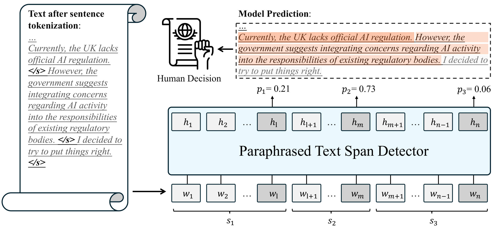

<div align="center">
<p align="center">
  
</p>
</div>

<div align="center">
<h1>Spotting AI’s Touch: Identifying LLM-Paraphrased Spans in Text</h1>
</div>

<div align="center">
 


<!-- **Authors:** -->
<br>

_**Yafu Li<sup>†</sup><sup>‡</sup>, Zhilin Wang<sup>§</sup>, Leyang Cui<sup>¶</sup>, Wei Bi<sup>¶</sup>,<br>**_
_**Shuming Shi<sup>¶</sup>, Yue Zhang<sup>‡</sup><br>**_

<!-- **Affiliations:** -->

_<sup>†</sup> Zhejiang University,
<sup>‡</sup> Westlake University,
<sup>§</sup> Jilin University,
<sup>¶</sup> Tencent AI Lab_

Presenting a comprehensive benchmark dataset designed to assess the proficiency of deepfake detectors amidst real-world scenarios.
Welcome to try detection via our **[online demo](https://detect.westlake.edu.cn)**!

</div>

## 📌 Table of Contents

- [Introduction](#-introduction)
- [Dataset](#-dataset)
- [Try Detection](#computer--try-detection)
- [Evaluation](#evaluation)
- [Citation](#citation)
<!-- - [Contributing](#-contributing) -->

## 🚀 Introduction

Recent advances in large language models (LLMs) have raised concerns about potential misuse, including student plagiarism and the spread of fake news.
A line of work focuses on AI-generated text detection, which assigns a label of `human-written` or `machine-generated` to a text.
In addition to pristine AI-generated texts, AI paraphrasing is frequently utilized to polish writings or enhance textual diversity.
AI paraphrasing can suffer from issues like hallucination and bias, which pose significant challenges to achieving trustworthy AI.
However, there is limited research on the fine-grained detection of texts partially paraphrased or polished by AI.

To this end, we propose a new task called paraphrased text span detection (PTD). The PTD approach is based on the observation that AI-paraphrased text exhibits distinct writing patterns compared to both the original text and its surrounding context. This repository contains the code to reproduce our experiments and deploy your own detector.
Our paper can be accessed through the [Spotting AI’s Touch: Identifying LLM-Paraphrased Spans in Text](https://arxiv.org/abs/2405.12689).


## 📝 Dataset

PASTED consists of in-distribution training, validation and test sets, along with a generalization testset. To simulate real-world scenarios, a sampling process is employed, which means randomly paraphrasing a text-span of several consecutive sentences in the original text. The selected text span consists of 1 to 10 sentences

**In-distribution** dataset incorporates 83,089 instances (28,473 original texts and 54,616 paraphrased texts) after text preprocessing and filtering. And the dataset is splited into train/validation/test sets, with an 80%/10%/10% partition.

**Generalization** Testset contains texts distinct from the in-distribution datasets. These texts were paraphrased by a novel LLM using different paraphrasing prompts. Ultimately, our OOD evaluation comprises a total of 9,372 instances.

### How to Get the Data

You can access the full dataset, which includes the original and processed data, through the Huggingface API:

```
from datasets import load_dataset
dataset = load_dataset("linzw/PASTED","classification")
# classification, regression-bleu4, regression-pos-bleu4,
# regression-syntax, regression-multi-dimension, text-classification,
# eval-multi-paraphrase, eval-OOD,raw-DIPPER, raw-GPT-3.5
```

Our experiment incorporates five basic training settings:

- **Classification**: Paraphrased spans are assigned a label of 1, otherwise 0.
- **Regression-BLEU4**: Paraphrased span signal is calculated using BLEU4.
- **Regression-POS-BLEU4**: Paraphrased span signal is calculated using POS-BLEU4.
- **Regression-Syntax**: Paraphrased span signal is calculated using syntax edit distance.
- **Regression-Multi-Dimension**: Aggregated signals from multiple dimensions.

Additionally, there are two additional testbeds:

- **Eval-Multi-Paraphrase**: Text contains multiple paraphrased spans.
- **Eval-OOD (Out of Distribution)**: Testbed for out-of-distribution data.

You can also access the original dataset without preprocessing:

- **Raw-DIPPER**
- **Raw-GPT-3.5**

## :computer: Try Detection

### Python Environment

For deploying your own paraphrased span detector, you can simply execute the `env.sh` or you can run:

```shell
pip install datasets transformers==4.36.2 nltk stanza evaluate \
scikit-learn spacy evaluate
pip install transformers[torch]
pip install openai rankgen retriv sentencepiece sacremoses
pip install Sentence-Transformers==2.2.2
```

### Model Access

```python
from detect import Detector

# init detector
device = 'cpu' # use 'cuda:0' if GPU is available
model_dir = "linzw/PASTED-Lexical"
detector = Detector(model_dir,device)

text = "Apple's new credit card will begin a preview roll out today and will become available to all iPhone owners in the US later this month. A random selection of people will be allowed to go through the application process, which involves entering personal details which are sent to Goldman Sachs and TransUnion. Applications are approved or declined in less than a minute. The Apple Card is meant to be broadly accessible to every iPhone user, so the approval requirements will not be as strict as other credit cards. Once the application has been approved, users will be able to use the card immediately from the Apple Wallet app. The physical titanium card can be requested during setup for free, and it can be activated with NFC once it arrives."

result = detector(text)
```

### Detection Performance

#### Golden

| Model      | AUROC↑ | Accuracy (FPR 1%)↑ | Lexical Corr.↑ | Syntactic Corr.↑ |
| ---------- | ------ | ------------------ | -------------- | ---------------- |
| **Random** | 0.50   | 0.00%              | 0.07           | 0.07             |
| **Oracle** | 1.00   | 100.00%            | 0.88           | 0.88             |

#### In-distribution Detection

| Model                    | AUROC↑   | Accuracy (FPR 1%)↑ | Lexical Corr.↑ | Syntactic Corr.↑ |
| ------------------------ | -------- | ------------------ | -------------- | ---------------- |
| **Classification**       | **0.97** | **69.27%**         | 0.64           | 0.67             |
| Regression (lexical)     | **0.97** | 64.04%             | 0.69           | 0.71             |
| Regression (grammatical) | 0.96     | 54.80%             | **0.70**       | **0.72**         |
| Regression (syntactic)   | 0.96     | 47.45%             | 0.67           | **0.72**         |
| Regression (aggregate)   | **0.97** | 59.45%             | **0.70**       | **0.72**         |

#### Out-of-distribution Detection

| Model                    | AUROC↑   | Accuracy (FPR 1%)↑ | Lexical Corr.↑ | Syntactic Corr.↑ |
| ------------------------ | -------- | ------------------ | -------------- | ---------------- |
| **Classification**       | **0.94** | **47.21%**         | 0.62           | 0.66             |
| Regression (lexical)     | **0.94** | 42.57%             | **0.66**       | **0.70**         |
| Regression (grammatical) | 0.93     | 20.29%             | **0.66**       | 0.69             |
| Regression (syntactic)   | 0.90     | 9.63%              | 0.60           | 0.65             |
| Regression (aggregate)   | **0.94** | 26.21%             | **0.66**       | **0.70**         |

## Evaluation

you can evaluate the model through evaluation.py:

```
python evaluation.py \
        --linzw/PASTED-Lexical \
        --device cuda \
        --gold_testfile file \
```

## Citation
If you use this dataset in your research, please cite it as follows:

```bibtex
@misc{li2024spotting,
      title={Spotting AI's Touch: Identifying LLM-Paraphrased Spans in Text}, 
      author={Yafu Li and Zhilin Wang and Leyang Cui and Wei Bi and Shuming Shi and Yue Zhang},
      year={2024},
      eprint={2405.12689},
      archivePrefix={arXiv},
      primaryClass={cs.CL}
}
'''
