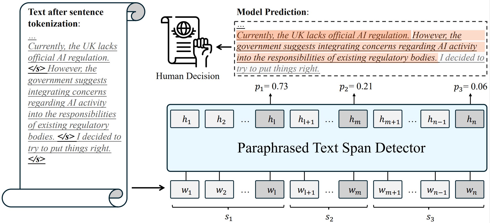

<div align="center">
<p align="center">
  
</p>
</div>

<div align="center">
<h1>Spotting AI’s Touch: Identifying LLM-Paraphrased Spans in Text</h1>
</div>

<div align="center">
 


<!-- **Authors:** -->
<br>

_**Yafu Li<sup>†</sup><sup>‡</sup>, Zhilin Wang<sup>§</sup>, Leyang Cui<sup>¶</sup>, Wei Bi<sup>¶</sup>,<br>**_
_**Shuming Shi<sup>¶</sup>, Yue Zhang<sup>‡</sup><br>**_

<!-- **Affiliations:** -->

_<sup>†</sup> Zhejiang University,
<sup>‡</sup> Westlake University,
<sup>§</sup> Jilin University,
<sup>¶</sup> Tencent AI Lab_

Presenting a comprehensive benchmark dataset designed to assess the proficiency of deepfake detectors amidst real-world scenarios.
Welcome to try detection via our **[online demo](https://detect.westlake.edu.cn)**!

</div>

## 📌 Table of Contents

- [Introduction](#-introduction)
- [Activities](#-activities)
- [Dataset](#-dataset)
- [Try Detection](#computer--try-detection)
- [Data Samples](#-data-samples)
- [Citation](#-citation)
<!-- - [Contributing](#-contributing) -->

## 🚀 Introduction

Recent advances in large language models (LLMs) ~\cite{llama,gpt3,gpt4} have raised concerns about potential misuse, including student plagiarism~\cite{plagiarism} and the spread of fake news~\cite{detect-gpt}.
A line of work~\cite{openai_detector,deepfake,detect-gpt,dna-gpt} focuses on AI-generated text detection, which assigns a label of `human-written'' or `machine-generated'' to a text.
In addition to pristine AI-generated texts, AI paraphrasing is frequently utilized to polish writings or enhance textual diversity.

## 📅 Activities

- 🎉 **May 16, 2024**: Our paper is accepted to ACL 2024!

## 📝 Dataset

The dataset consists of 447,674 human-written and machine-generated texts from a wide range of sources in the wild:

Human-written texts from 10 datasets covering a wide range of writing tasks, e.g., news article writing, story generation, scientific writing, etc.
Machine-generated texts generated by 27 mainstream LLMs from 7 sources, e.g., OpenAI, LLaMA, and EleutherAI, etc.
8 systematic testbeds with increasing wildness and detection difficulty.

### How to Get the Data

You can access the full dataset, which includes the original and processed data, through the Huggingface API:

```
from datasets import load_dataset
dataset = load_dataset("linzw/PASTED","classification")
# classification, regression-bleu4, regression-pos-bleu4,
# regression-syntax, regression-multi-dimension, text-classification,
# eval-multi-paraphrase, eval-OOD,raw-DIPPER, raw-GPT-3.5
```

## :computer: Try Detection

### Python Environment

For deploying your own paraphrased span detector, you can simply execute the `env.sh` or you can run:

```
pip install datasets transformers==4.36.2 nltk stanza evaluate \
scikit-learn spacy evaluate
pip install transformers[torch]
pip install openai rankgen retriv sentencepiece sacremoses
pip install Sentence-Transformers==2.2.2
```

### Model Access

### Detection Performance

#### Golden

| Model      | AUROC↑ | Accuracy (FPR 1%)↑ | Lexical Corr.↑ | Syntactic Corr.↑ |
| ---------- | ------ | ------------------ | -------------- | ---------------- |
| **Random** | 0.50   | 0.00%              | 0.07           | 0.07             |
| **Oracle** | 1.00   | 100.00%            | 0.88           | 0.88             |

#### In-distribution Detection

| Model                    | AUROC↑   | Accuracy (FPR 1%)↑ | Lexical Corr.↑ | Syntactic Corr.↑ |
| ------------------------ | -------- | ------------------ | -------------- | ---------------- |
| **Classification**       | **0.97** | **69.27%**         | 0.64           | 0.67             |
| Regression (lexical)     | **0.97** | 64.04%             | 0.69           | 0.71             |
| Regression (grammatical) | 0.96     | 54.80%             | **0.70**       | **0.72**         |
| Regression (syntactic)   | 0.96     | 47.45%             | 0.67           | **0.72**         |
| Regression (aggregate)   | **0.97** | 59.45%             | **0.70**       | **0.72**         |

#### Out-of-distribution Detection

| Model                    | AUROC↑   | Accuracy (FPR 1%)↑ | Lexical Corr.↑ | Syntactic Corr.↑ |
| ------------------------ | -------- | ------------------ | -------------- | ---------------- |
| **Classification**       | **0.94** | **47.21%**         | 0.62           | 0.66             |
| Regression (lexical)     | **0.94** | 42.57%             | **0.66**       | **0.70**         |
| Regression (grammatical) | 0.93     | 20.29%             | **0.66**       | 0.69             |
| Regression (syntactic)   | 0.90     | 9.63%              | 0.60           | 0.65             |
| Regression (aggregate)   | **0.94** | 26.21%             | **0.66**       | **0.70**         |

## 📄 Data Samples
